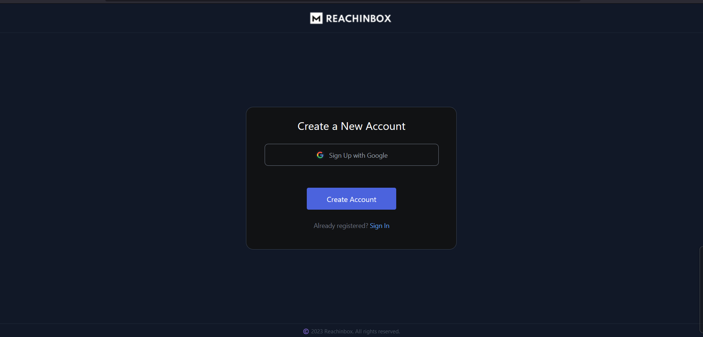
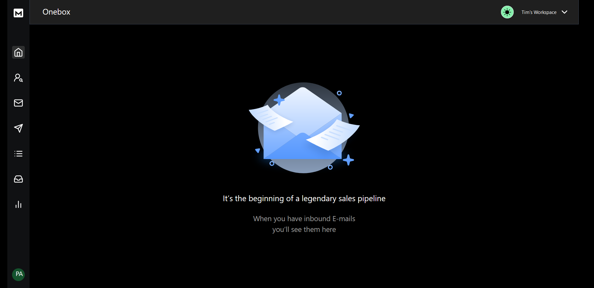
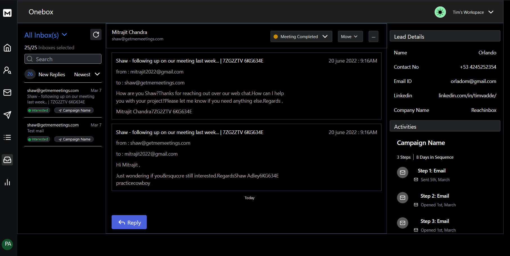
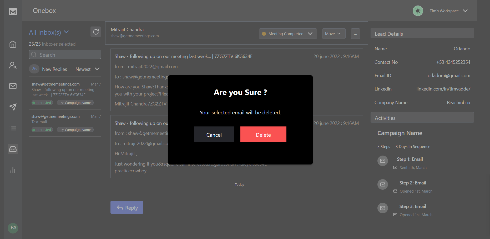
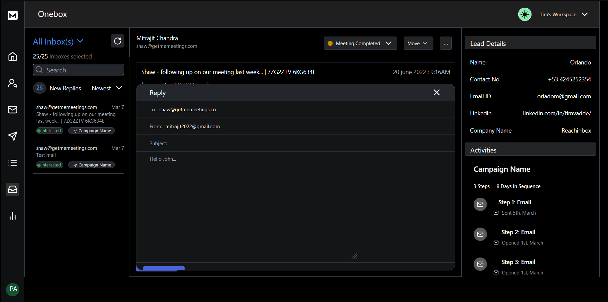
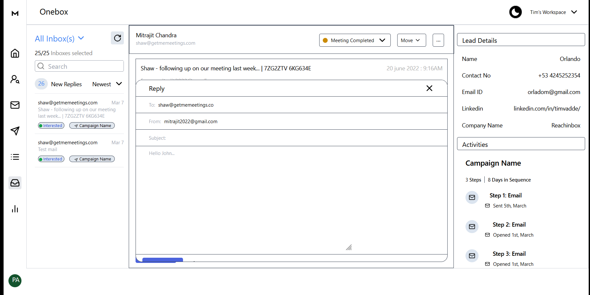
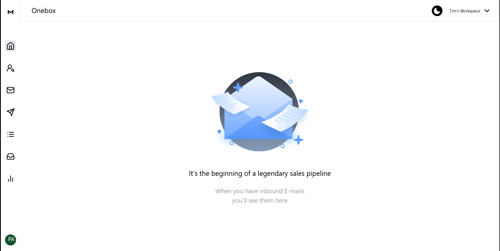

# ReachInbox.AI
Assignment-Associate Frontend Engineer

## Introducing ReachInbox

**ReachInbox** is an AI-powered platform designed to streamline cold email outreach for businesses. It leverages artificial intelligence to create personalized email sequences, ensuring high deliverability and engagement by keeping emails out of spam folders. Some key features include unlimited email account management, automated email warm-ups, and multi-channel outreach, allowing businesses to scale their outreach campaigns effectively across platforms like LinkedIn, Twitter, and email.


## Technologies Used:
* React.js
* Tailwind CSS
* Typescript
* Firebase

## Steps To Run Locally

#### 1. Clone the Repository:

```bash
  git clone git@github.com:MrPrajwal12/Reachinboxai_Assessment.git
```
#### 2. Navigate to project directory:

```bash
  cd Reachinboxai
```
#### 3. Install Dependencies:

```bash
  npm install
```
#### 4. Install Tailwind CSS:

```bash
  npm install -D tailwindcss
  npx tailwindcss init
```
#### 5. Run the Application:

```bash
  npm run start
```
#### 6. Access the Application: 
      
```bash
  http://localhost:3000
```


## Deployment

Install firebase

```bash
  npm install firebase
  npm install --save-dev @types/firebase
```

Firebase Login

```bash
  firebase login
```
Firebase Initialization

```bash
  firebase init
```
Deploy files to Firebase

```bash
  firebase deploy
```

The application is deployed on **Firebase** and can be accessed[](https://reachinboxai-91743.web.app/)
## Screenshots









## Demo video Link:

https://drive.google.com/file/d/1tv2m554cFgQHugWghcxLrf8Pv3uhWNkT/view?usp=sharing
